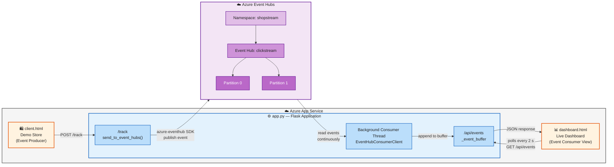

# CST8916 Assigment 2

**Student Name**: IDRIS JOVIAL SOP NWABO

**Student ID**: 041199877

**Course**: CST8916 Remote Data and Real Time Application

**Semester**: Winter 2026

---

## Demo Video

🎥 [Watch Demo Video](https://www.youtube.com/watch?v=v6r1V-HwIVE)

---

## Technical Explanations

- [GitHub](https://github.com/sopn0001/26W_CST8916_Week10-Event-Hubs-Lab)

Architecture diagram showing how data flows from the store to the dashboard through Stream Analytics
Design decisions — why you chose your approach for enriching events and connecting Stream Analytics output to the dashboard
Setup instructions — how to run your solution (environment variables, Azure resources needed, etc.)

## Architecture

---

## Challenges and Learnings (Optional)

---

## Acknowledgments

[Optional: Credit any resources, documentation, or people who helped you]
